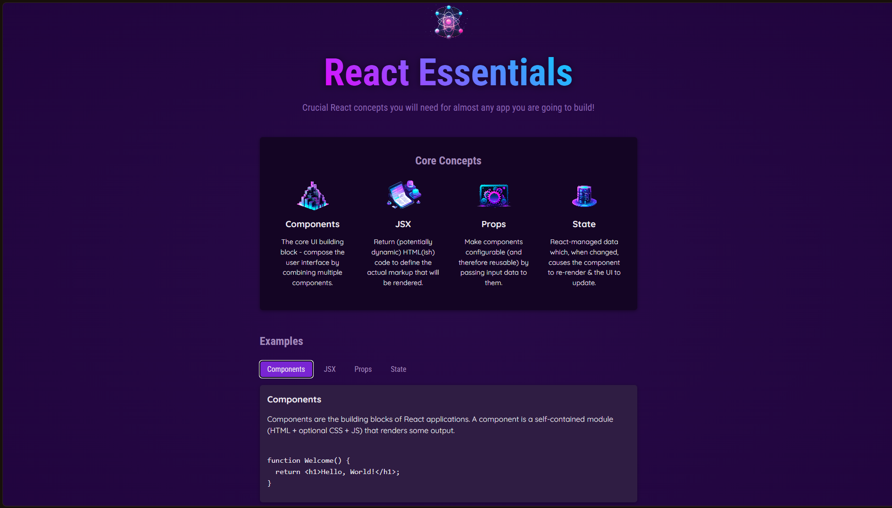

# React Essentials Viewer

An interactive reference application built with React and Vite to explore the concepts used in almost every React application. This project was developed as part of [React - The Complete Guide](https://www.udemy.com/course/react-the-complete-guide-incl-redux/) by Academind.

---

## Project Overview

The application presents four essential React concepts: Components, JSX, Props, and State. Users can select a topic and view its explanation together with a practical code example, while the main page introduces each concept through reusable visual cards.

---

## Preview



---

## Features

- Interactive overview of four core React concepts
- Reusable concept cards generated from structured data
- Tab navigation for Components, JSX, Props, and State examples
- Conditional rendering for the selected example
- Syntax-formatted code snippets displayed with each topic
- Reusable section, card, tab, and button components
- Randomized introductory header description
- Responsive layout with custom component styling

---

## Technologies & Tools


- React 19
- React DOM
- Vite
- JavaScript and JSX
- CSS

---

## Getting Started

### Prerequisites

- Node.js and npm installed

### Installation

From this project directory, install the dependencies:

```bash
npm install
```

### Run the development server

```bash
npm run dev
```

Open the local URL shown by Vite in your browser.

---

## Available Scripts

| Command | Description |
| :--- | :--- |
| `npm run dev` | Start the Vite development server |
| `npm run build` | Create a production build |
| `npm run preview` | Preview the production build locally |

---

## Project Structure

```text
src/
  App.jsx                       # Top-level application layout
  data.js                       # Core concepts and example content
  index.jsx                     # React DOM entry point
  index.css                     # Global styles
  assets/                       # Concept illustrations and graphics
  components/
    Card/                       # Reusable content container
    CoreConcept/                # Concept cards and concept grid
    Examples/                   # Interactive example tabs and content
    Header/                     # Page header and introductory content
    Section/                    # Reusable section wrapper
    Tabs/                       # Flexible tab container
    TabButton.jsx               # Reusable selectable tab button
```

---

## How It Works

`data.js` contains the concept cards and example content. `CoreConcepts.jsx` maps over the concept data to render reusable `CoreConcept` components. `Examples.jsx` stores the selected topic in React state and conditionally renders the matching title, description, and code sample.

The `Tabs` component receives its buttons through a `buttons` prop and supports a configurable container element. `TabButton` forwards standard button props, allowing the parent component to control selection and click behavior without duplicating tab logic.

---

## Learning Focus

- Building reusable functional components
- Passing data through props and spread props
- Rendering lists from structured data
- Managing interaction with `useState`
- Conditional rendering based on application state
- Component composition and slot-style content projection
- Separating application data from presentation components