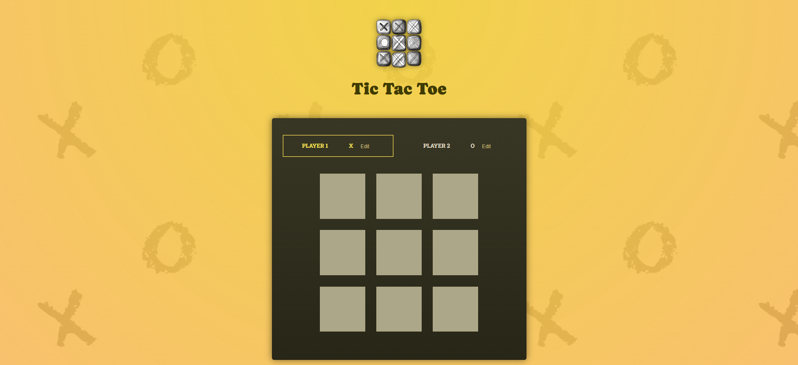
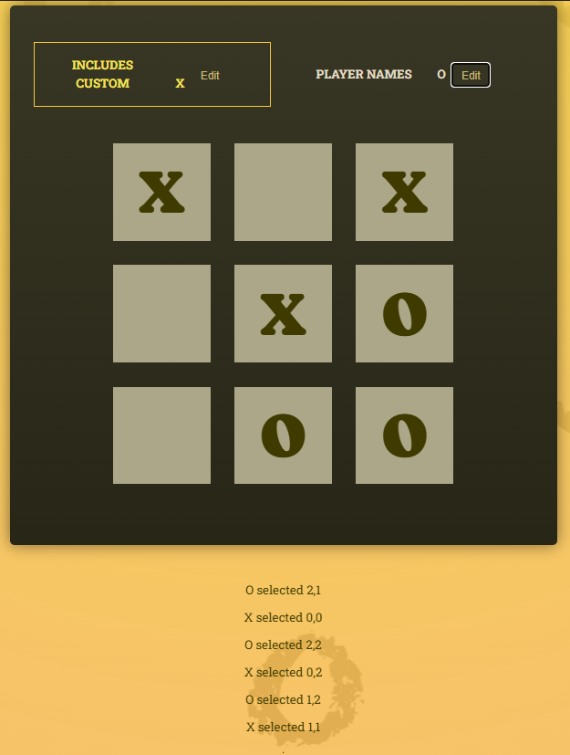
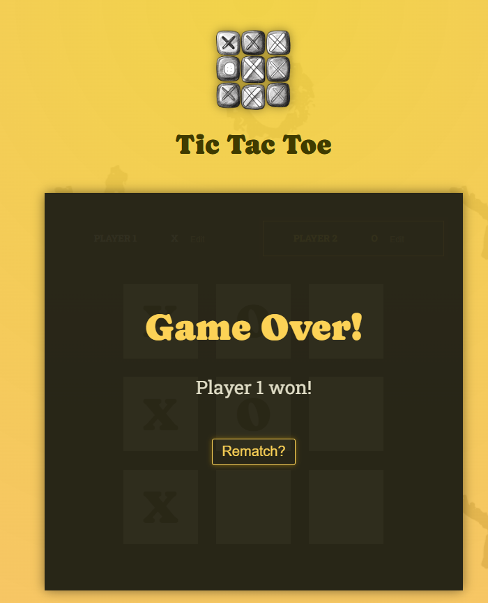

# React Tic-Tac-Toe

A two-player Tic-Tac-Toe game built with React and Vite. This project explores state management, derived state, controlled inputs, component composition, and event handling through a complete interactive game.

---

## Project Overview

Players take turns placing `X` and `O` on a 3 x 3 board. The game calculates the board, active player, winner, and draw state from the recorded turn history. Players can also edit their display names and start a rematch after the game ends.

---

## Preview Screenshots

### Empty Board



### Active Game



### Game Over



---

## Features

- 3 x 3 interactive Tic-Tac-Toe board
- Alternating turns automatically between `X` and `O`
- Active-player highlighting
- Editable player names with controlled inputs
- Occupied squares disabled after selection
- Winner detection for rows, columns, and diagonals
- Draw detection when all squares are filled
- Game-over feedback showing the winner or draw result
- Rematch action that resets the board and turn history
- Visible log history of every move
- Responsive styling with a hand-drawn visual theme

---

## Technologies & Tools


- React 19
- React DOM
- Vite
- JavaScript and JSX
- CSS

---

## Getting Started

### Prerequisites

- Node.js and npm installed

### Installation

From this project directory, install the dependencies:

```bash
npm install
```

### Run the development server

```bash
npm run dev
```

Open the local URL shown by Vite in your browser.

---

## Available Scripts

| Command | Description |
| :--- | :--- |
| `npm run dev` | Start the Vite development server |
| `npm run build` | Create a production build |
| `npm run preview` | Preview the production build locally |
| `npm run lint` | Run ESLint checks |

---

## Project Structure

```text
src/
  App.jsx                       # Application state and derived game logic
  index.jsx                     # React entry point
  index.css                     # Global and game styles
  winning-combinations.js       # Rows, columns, and diagonal combinations
  components/
    GameBoard.jsx               # Board rendering and square selection
    GaveOver.jsx                # Winner/draw message and rematch action
    Log.jsx                     # Recorded move history
    Player.jsx                  # Name editing and active-player display
```

---

## How It Works

`App.jsx` stores the player names and turn history. The visible board, active player, winner, and draw state are derived from that history rather than duplicated in separate state variables.

`GameBoard.jsx` renders the current board and prevents occupied squares from being selected. `winning-combinations.js` defines all possible winning rows, columns, and diagonals. When a game ends, `GaveOver.jsx` displays the result and clears the turn history when the players choose a rematch.

---

## Learning Focus

- Managing related state with React hooks
- Deriving values from existing state
- Passing data and callbacks between components
- Building controlled form inputs
- Handling user events and disabled controls
- Separating game rules from presentation components
- Lifting state and computed values up
- immutability between values
